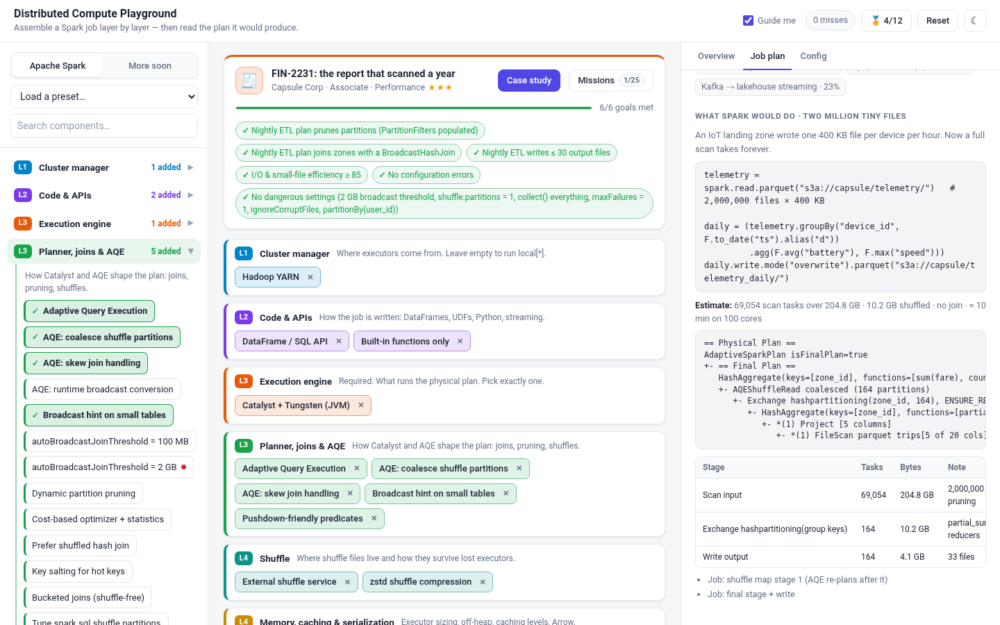
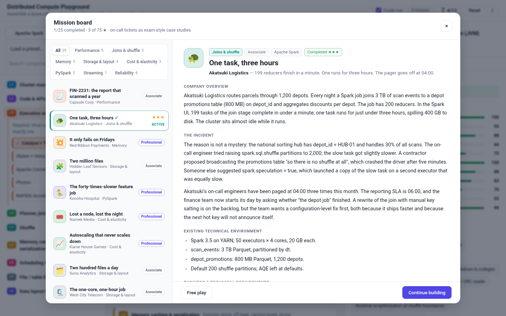
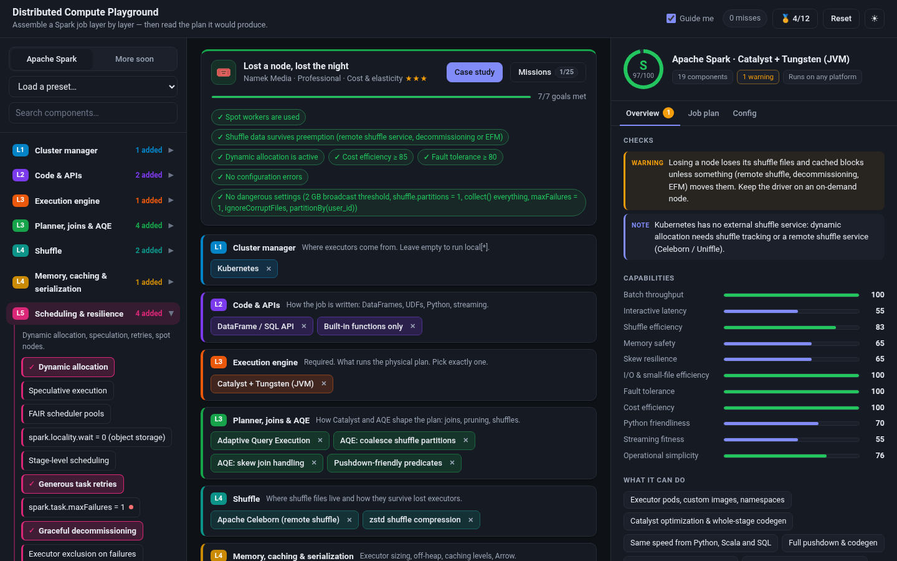
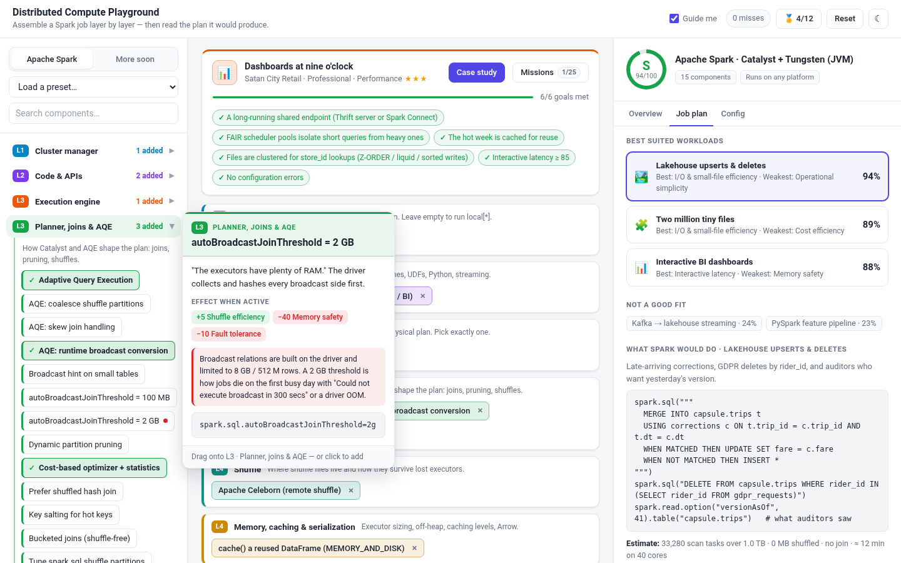
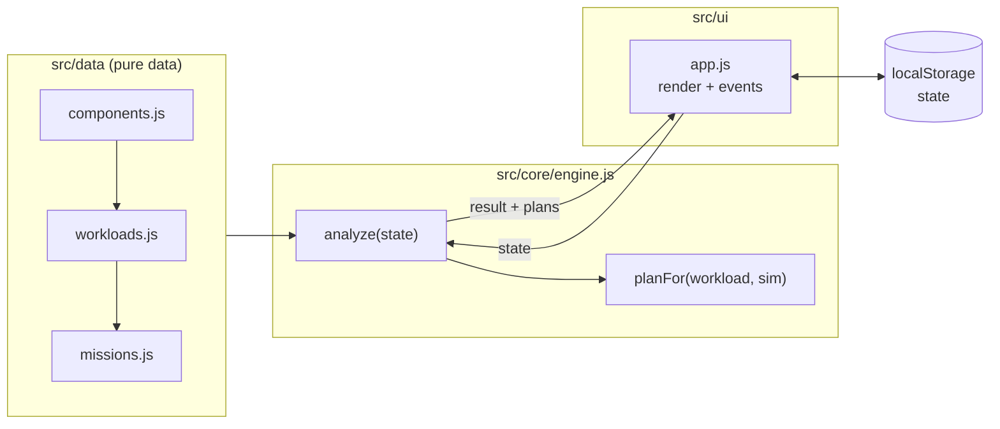

# Distributed Compute Playground

[](https://github.com/AnikethSD/distributed-computing-playground/actions/workflows/ci.yml)
[](LICENSE)


**Assemble an Apache Spark job by drag and drop, then read the plan it would produce.**

Distributed Compute Playground is a static, gamified learning tool for how an **Apache Spark** job is put together, layer by layer:

- cluster manager (YARN, Kubernetes, standalone, serverless, local)
- code and APIs (DataFrames, UDFs, Pandas, Spark Connect, Structured Streaming)
- execution engine (Catalyst + Tungsten, Photon, Gluten, Comet, RAPIDS)
- planner: joins, AQE, pruning, shuffle partitions
- shuffle and memory
- scheduling and resilience
- file / table formats and data layout

Drop components onto colour-coded layers. The playground analyses your job immediately and tells you:

- which workloads it suits and which it does not
- which settings are dangerous
- **what Spark would actually do:** an `explain()`-style physical plan, the stage DAG, task counts, bytes shuffled, output files and a time estimate, all recomputed as you build

Then take on **25 exam-style case-study missions**, written as on-call tickets in the spirit of Google Cloud Professional Data Engineer questions.



> [!NOTE]
> Everything runs locally in the browser: no build step, no dependencies, no network calls.
> Open `index.html` and play.

> [!TIP]
> This playground is the hands-on companion to the article **What Actually Happens When You Call `spark.read`? One Line of Python, a Thousand Tasks** (on dev.to).
> Mission 1, *FIN-2231*, is the exact ticket from that story.

---

## Table of contents

- [Features](#features)
- [Quick start](#quick-start)
- [How to play](#how-to-play)
- [The job simulator](#the-job-simulator)
- [Missions](#missions)
- [Project structure](#project-structure)
- [Architecture](#architecture)
- [Testing](#testing)
- [Contributing](#contributing)
- [License](#license)

## Features

| | |
| :-- | :-- |
| 🧱 **9 colour-coded layers** | Each layer's colour is shared by its palette group, its stack slot and its hover card. With **Guide me** on, the target layer lights up while you drag. |
| 🧩 **104 components** | Cluster managers, APIs, engines, planner knobs, shuffle services, memory settings, schedulers, formats and layouts. Each has effects, prerequisites, conflicts, platform availability, a config / PySpark snippet and simulator flags. |
| 🔬 **Job plan tab** | For each of 10 workloads the playground derives the physical plan (`BroadcastHashJoin` vs `SortMergeJoin`, `PartitionFilters`, `AQEShuffleRead`…), the stage DAG with task counts and bytes, the number of jobs, output files and an estimated runtime. |
| 📊 **Live analysis** | 11 capability scores, a grade from S to D, health checks (danger, error, warning, tip), best-fit workloads with PySpark code, and a generated `spark-submit` + `spark-defaults.conf`. |
| 🎯 **25 case-study missions** | Each is a ~300-word on-call ticket with company overview, incident, environment, requirements with distractors, an executive quote and a **hidden question**. Goals are hidden too and are checked as you build, including goals about the *plan* ("joins zones with a BroadcastHashJoin"). |
| ⭐ **Stars and achievements** | 3 stars per mission. Revealing goals or the reference answer costs stars. 12 achievements, from *Ignition* to *No Exchange* and *Grand architect*. |
| ☁️ **Platform awareness** | Components declare which platforms ship them (open-source Spark, Dataproc, EMR, Databricks). Mixing Photon with YARN tells you the job *runs nowhere*. |
| 🌗 **Light and dark themes** | Follows `prefers-color-scheme`, with a toggle in the header. |
| ♿ **Keyboard and screen readers** | Components can be added with Enter or Space. Results panels use ARIA live regions. The mission board is a native `<dialog>`. |

<table>
  <tr>
    <td></td>
    <td></td>
  </tr>
  <tr>
    <td align="center"><sub>Mission board: exam-style case study with hidden question</sub></td>
    <td align="center"><sub>Overview: checks, capability bars, platform tag (dark theme)</sub></td>
  </tr>
  <tr>
    <td colspan="2"></td>
  </tr>
  <tr>
    <td colspan="2" align="center"><sub>Hover card: effects, why a setting is dangerous, and the exact config line</sub></td>
  </tr>
</table>

## Quick start

```bash
git clone https://github.com/AnikethSD/distributed-computing-playground.git
cd distributed-computing-playground

# Option 1: just open the file
xdg-open index.html        # macOS: open index.html

# Option 2: serve it (any static server works)
npm start                  # python3 -m http.server 8000, then visit http://localhost:8000
```

The app uses classic `<script>` tags rather than ES modules on purpose, so it works straight from `file://`.

To host it, enable **GitHub Pages** for this repository (Settings → Pages → *Deploy from a branch* → `main` / root). It needs no build step.

## How to play

1. **Pick a family.** Apache Spark is available today; the data model already carries a family tag on every component so a second engine family can be added later.
2. **Drag components** from the left palette onto the matching coloured layer, or click a component to add it.
   - Dropping onto the wrong layer counts as a *miss*.
   - Hover over any component for a readable card with its effects, prerequisites and the exact config or code line.
   - A red dot marks settings that are **dangerous** (for example `autoBroadcastJoinThreshold = 2 GB`).
3. **Read the analysis** on the right:
   - **Overview:** checks, capability bars and "what it can do".
   - **Job plan:** best-fit workloads with PySpark code, the physical plan Spark would produce, stages, tasks and the estimate.
   - **Config:** the generated `spark-submit` command, `spark-defaults.conf` and PySpark session code.
4. **Take a mission.** Open **Case study**, read the ticket, reveal the question, and build the job that answers it.

<details>
<summary><b>Scoring details</b></summary>

- **Capabilities:** the engine's base scores plus the effects of every *active* component and synergy (for example AQE + skew join handling), clamped to 0–100.
- A component is **inactive** (and contributes nothing) if a prerequisite is missing, it does not apply to the chosen engine, or it conflicts with another component.
- **Workload fit** is a weighted sum of capabilities. Workloads that need specialised pieces (such as a table format for lakehouse upserts, or Structured Streaming for the Kafka workload) are scaled down if those pieces are missing.
- **Score** = best workload fit − 8 × errors − 12 × dangers. **Grade:** S ≥ 90, A ≥ 80, B ≥ 65, C ≥ 50, otherwise D.
- **Mission stars:** 3 by default, 2 if you revealed the goals, 1 if you revealed the reference answer.

</details>

## The job simulator

The **Job plan** tab is what makes this playground different from a scorecard. Every workload carries a small description of its data (table size, file count, file size, partition column, dimension size, join type, output size). The engine combines that with the *simulator flags* of the components you placed and derives:

| Output | Driven by |
| :-- | :-- |
| `PartitionFilters` populated or empty | partitioned layout + pushdown-friendly predicate, or dynamic partition pruning for star joins |
| `BroadcastHashJoin` / `SortMergeJoin` / AQE runtime broadcast / bucketed join | broadcast threshold, broadcast hint, CBO statistics, AQE, bucketing |
| Scan task count | files × file size ÷ `maxPartitionBytes`, or one task per file for gzip CSV |
| Shuffle partitions and `AQEShuffleRead coalesced` | default 200, tuned partitions, AQE coalescing |
| Skew handling | AQE skew split, key salting, or a straggler task in the notes |
| Output files | `coalesce` / `repartition` before write, target file size, table-format compaction |
| Commit cost | object-store rename penalty unless a committer or table format is used |
| Runtime estimate | task count, bytes per task, executor slots, engine speed, spot interruptions |
| Jobs | one per Exchange when AQE re-plans, plus the final stage |

Streaming workloads use a separate model (state size, RocksDB, watermark bounding, exactly-once sinks).

Numbers are **teaching heuristics**, tuned so that the right lever moves the right number by a believable amount. They are not benchmarks.

## Missions

Each mission is a ~300–360-word on-call ticket. Its sections are:

- company overview
- the incident
- existing technical environment
- business and technical requirements (including red herrings)
- an executive quote
- a hidden question

Several stories include tempting "fixes" such as raising `autoBroadcastJoinThreshold` to 2 GB, setting `spark.task.maxFailures = 1`, `collect()`-ing a result, or turning on `ignoreCorruptFiles`. Accepting them fails the hidden goals. After completing a mission, a debrief explains *why* the reference answer works.

| # | Mission | Company | Category | Level |
| --: | :-- | :-- | :-- | :-- |
| 1 | 🧾 FIN-2231: the report that scanned a year | Capsule Corp | Performance | Associate |
| 2 | 🐢 One task, three hours | Akatsuki Logistics | Joins & shuffle | Associate |
| 3 | 💥 It only fails on Fridays | Red Ribbon Payments | Memory | Professional |
| 4 | 🧩 Two million files | Hidden Leaf Sensors | Storage & layout | Associate |
| 5 | 🐍 The forty-times-slower feature job | Konoha Hospital | PySpark | Professional |
| 6 | 🎟️ Lost a node, lost the night | Namek Media | Cost & elasticity | Professional |
| 7 | 📈 Autoscaling that never scales down | Kame House Games | Cost & elasticity | Professional |
| 8 | 🗂️ Two hundred files a day | Suna Analytics | Storage & layout | Associate |
| 9 | 🗜️ The one-core, one-hour job | West City Telecom | Storage & layout | Associate |
| 10 | 📊 Dashboards at nine o'clock | Satan City Retail | Performance | Professional |
| 11 | 🌊 The stream that ate the heap | Byakugan Pay | Streaming | Professional |
| 12 | 🔁 Double-counted refunds | Sharingan Ledger | Reliability | Expert |
| 13 | 🕳️ toPandas() on twenty gigabytes | Gero Labs | Memory | Associate |
| 14 | 🫧 The cache that made it slower | Mist Village Insurance | Memory | Professional |
| 15 | 🎮 A GPU for the wide table | Saiyan Genomics | Performance | Expert |
| 16 | 🚀 CPU-bound at three in the morning | Fire Country Bank | Performance | Professional |
| 17 | ⭐ The quarter that scanned two years | Ichiraku Mart | Joins & shuffle | Professional |
| 18 | 🪣 Five terabytes meets five terabytes | Zeni Payments | Joins & shuffle | Expert |
| 19 | 📋 The day the column became a string | Hyuga Logistics | Reliability | Associate |
| 20 | 🧾 Half a report | Uchiha Analytics | Reliability | Professional |
| 21 | 🛰️ Three seconds of nothing | Frieza Force Freight | Performance | Associate |
| 22 | ⚖️ One notebook to starve them all | Konoha Ninja Academy | Reliability | Professional |
| 23 | 🧪 Scoring 300 million riders before breakfast | Shunshin Rides | PySpark | Expert |
| 24 | 🧬 Delete me, by Friday | Chakra Health | Storage & layout | Professional |
| 25 | ⚡ Photon on a budget | Orange Star Commerce | Cost & elasticity | Professional |

Companies and people in the case studies are fictional. Their names are borrowed from the **Naruto** and **Dragon Ball Z** universes (Capsule Corp, Konoha Hospital, Kakashi Hatake, Bulma Briefs…) purely as recognisable placeholders, so no real company or person is ever quoted. See [docs/authoring-missions.md](docs/authoring-missions.md) to write your own.

## Project structure

```text
.
├── index.html                 # App shell: layout, dialogs, script order
├── src/
│   ├── data/                  # Pure data: no DOM, no side effects beyond window.DCP
│   │   ├── components.js      # Layers (SLOTS), capability dimensions (DIMS), 104 components, synergies
│   │   ├── workloads.js       # 10 workloads with plan specs + PySpark code, achievements, presets, platforms
│   │   └── missions.js        # 25 case-study missions, categories, levels
│   ├── core/
│   │   └── engine.js          # DCP.analyze(state) and the job simulator DCP.planFor(); pure functions
│   ├── ui/
│   │   └── app.js             # Rendering, drag and drop, hover card, mission board, Job plan tab, persistence
│   └── styles/
│       └── app.css            # Design tokens (light/dark), per-layer colour system, components
├── tests/
│   ├── helpers/load-dcp.js    # Loads the browser scripts into Node for testing
│   ├── catalogue.test.js      # Referential integrity of components, workloads, presets
│   ├── engine.test.js         # Analysis engine and job simulator behaviour
│   ├── missions.test.js       # Every mission is well-formed and solvable; traps fail
│   └── ui/                    # Headless-Chrome end-to-end spec + runner
├── docs/
│   ├── architecture.md        # Design, data model, analysis + simulation algorithm
│   ├── authoring-missions.md  # How to add a case study
│   └── images/                # Screenshots used in this README
├── .github/workflows/ci.yml   # Syntax check, unit tests, UI tests
├── CONTRIBUTING.md
├── LICENSE                    # Apache 2.0
└── package.json               # Scripts only; zero dependencies
```

## Architecture



- **Unidirectional loop.** Every user action changes `state`, then calls `update()`, which runs `analyze(state)` and re-renders the palette, stack, mission card and analysis panel.
- **Pure analysis.** `engine.js` has no DOM access, so the same functions power the UI, the mission checks and the Node test suite.
- **Simulation from flags, not from rules per component.** Each component contributes a few `sim` flags (`broadcastMB`, `pruneOK`, `aqe`, `splittable`, `committer`…). `planFor()` reads only the merged flags, so new components rarely need engine changes.
- **Secure by construction.** All DOM content is created with `textContent` (no `innerHTML` with data), and there is no network access at all.

Read more in [docs/architecture.md](docs/architecture.md).

## Testing

Requires Node.js ≥ 20. There is nothing to install.

```bash
npm run check     # syntax-check every source file
npm test          # catalogue, engine, simulator and mission tests (node:test) — 110 tests
npm run test:ui   # end-to-end UI spec in headless Chrome (set CHROME_BIN if needed) — 48 assertions
npm run test:all  # everything
```

The mission tests prove that every reference answer passes its own hidden goals with zero configuration errors and zero dangerous settings. They also check that the traps described in the stories really do fail, and that the simulator's levers move in the right direction (pruning cuts tasks, the hint flips the join, AQE coalesces partitions, gzip makes one task per file).

## Contributing

Contributions are welcome, especially new case studies, new simulator levers and corrections to component facts. See [CONTRIBUTING.md](CONTRIBUTING.md).

If the playground taught you something, a ⭐ on the repo helps other engineers find it.

## License

Licensed under the [Apache License, Version 2.0](LICENSE).

*Apache Spark, Databricks, Photon, Delta Lake, Apache Iceberg, Apache Hudi, Apache Celeborn, Apache Gluten, Apache DataFusion Comet, NVIDIA RAPIDS, Amazon EMR, Google Dataproc and other names are trademarks of their respective owners. This is an independent educational project, not affiliated with any of them. Capability scores and plan estimates are deliberately simplified teaching heuristics, not benchmarks. Naruto characters and entities are the property of Masashi Kishimoto / Shueisha; Dragon Ball Z characters and entities are the property of Akira Toriyama / Bird Studio / Shueisha / Toei Animation. They appear here only as fictional placeholder names in educational case studies; no affiliation or endorsement is implied.*
